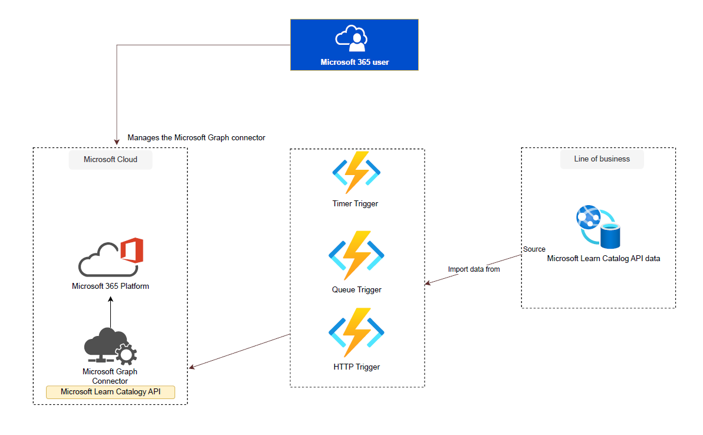
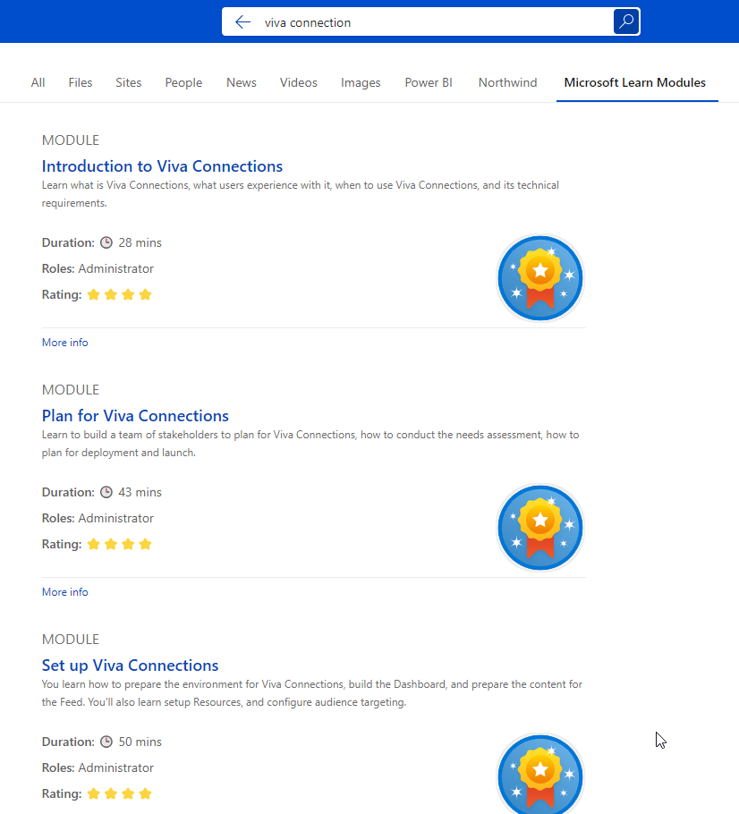

# Ingest Microsoft Learn Catalog API content using C# and .NET

## Summary

This example includes a Microsoft Graph connector demonstrating the ingestion of Microsoft Learn Catalog API modules into Microsoft 365. It retrieves details about each module and associated metadata using the Microsoft Learn Catalog API, aligns them with the external connection's schema, and ingests the content while preserving both the content itself and its metadata. The ingested content is configured to be accessible to all members within the organization.

## Architecture

## Microsoft Graph docs displayed in Microsoft Search search results

## Contributors

- [Ejaz Hussain](https://github.com/ejazhussain)

## Version history

Version|Date|Comments
-------|----|--------
1.0|December 30, 2023|Initial release

## Prerequisites
  
- [Microsoft 365 Developer tenant](https://developer.microsoft.com/microsoft-365/dev-program)
- [.NET 6](https://dotnet.microsoft.com/download/dotnet/6.0)

- [Visual studio 2022 IDE](https://visualstudio.microsoft.com/):

  Ensure that you have Visual Studio 2022 installed on your machine. You can download it from the official Visual Studio website.

- Azure Functions Tools:

  Install the Azure Functions Tools for Visual Studio via the Visual Studio installer. Ensure that the "Azure Development" workload is selected.
  
- [Microsoft Graph PowerShell SDK](https://learn.microsoft.com/powershell/microsoftgraph/installation?view=graph-powershell-1.0)

- Microsoft PowerShell

## Minimal path to awesome

- Clone this repository (or [download this solution as a .ZIP file](https://pnp.github.io/download-partial/?url=https://github.com/pnp/graph-connectors-samples/tree/main/samples/dotnet-csharp-learncatalogconnector) then unzip it)
- Run the setup script: `./setup.ps1`. When finished, it will display ClientID, ClientSecret and TenantID. Copy these into local.settings.json file
- Build the project: `dotnet build`  

## Steps to run OnDemand function locally:

1. Open project in Visual Studio 2022
2. Ensure that `local.settings.json` file updated with ClientId, ClientSecret and TenantId
3. Click the "Start Debugging" button (or press `F5`). This will build your project, start the Azure Functions runtime locally, and attach the debugger.
4. Send a GET request to the OnDemandContent function URL
`http://localhost:7248/api/OnDemandContent`
5. This will create connection, schema and ingest the Microsoft Learn Catalog API modules content in Microsoft 365 

## Steps to publish an Azure Function from Visual Studio 2022

1. Right-click the Azure Functions project in Solution Explorer:

2. Select "Publish...":

3. Choose "Azure" as the target:

4. Select "Azure Function App (Windows)" as the specific target:

5. Create a new Azure Function App or select an existing one:

6. Click "Publish" to deploy the function app to Azure.

## Making a GET Request Using Postman or Other HTTP Client

1. Obtain the function's URL:

Access the Azure portal and navigate to your function app.
Under "Functions," find the HTTP trigger function you want to test.
Copy the function's URL, which will be in the format https://<function-app-name>.azurewebsites.net/api/<function-name>.
2. Open Postman or your preferred HTTP client:

3. Create a new GET request:

4. Paste the function's URL into the request address bar:

5. Click "Send" to execute the GET request.

8. Inspect the response in the client to verify successful execution.

## Features

This example includes a Microsoft Graph connector demonstrating the ingestion of Microsoft Learn Catalog API modules into Microsoft 365. It retrieves details about each module and associated metadata using the Microsoft Learn Catalog API, aligns them with the external connection's schema, and ingests the content while preserving both the content itself and its metadata. The ingested content is configured to be accessible to all members within the organization.

The sample illustrates the following concepts:

- script creating the Entra (Azure AD) app registration using the Microsoft Graph PowerShell SDK
- create external connection including URL to item resolver to track activity when users share external links
- create external connection schema
- support full ingestion of data
- support scheduled ingestion of data
- support on-demand ingestion of data
- visualize the external content in search results using a custom Adaptive Card
- extend Microsoft Graph .NET SDK with a middleware to wait for a long-running operation to complete
- extend Microsoft Graph .NET SDK with a debug middleware to show information about outgoing requests and incoming responses

## Help

We do not support samples, but this community is always willing to help, and we want to improve these samples. We use GitHub to track issues, which makes it easy for  community members to volunteer their time and help resolve issues.

You can try looking at [issues related to this sample](https://github.com/pnp/graph-connectors-samples/issues?q=label%3A%22sample%3A%dotnet-csharp-learncatalogconnector%22) to see if anybody else is having the same issues.

If you encounter any issues using this sample, [create a new issue](https://github.com/pnp/graph-connectors-samples/issues/new).

Finally, if you have an idea for improvement, [make a suggestion](https://github.com/pnp/graph-connectors-samples/issues/new).

## Disclaimer

**THIS CODE IS PROVIDED *AS IS* WITHOUT WARRANTY OF ANY KIND, EITHER EXPRESS OR IMPLIED, INCLUDING ANY IMPLIED WARRANTIES OF FITNESS FOR A PARTICULAR PURPOSE, MERCHANTABILITY, OR NON-INFRINGEMENT.**

